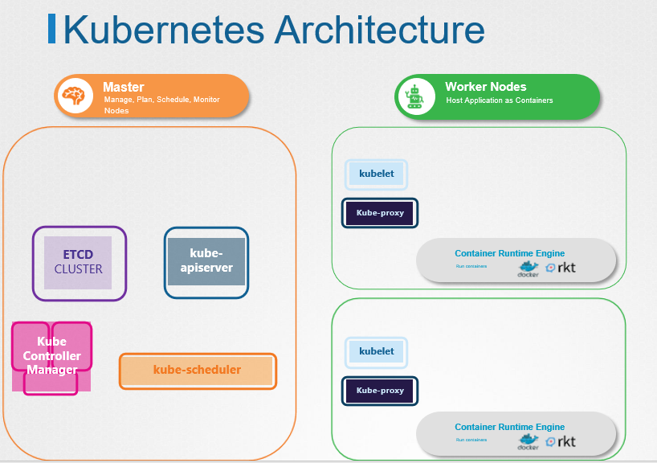
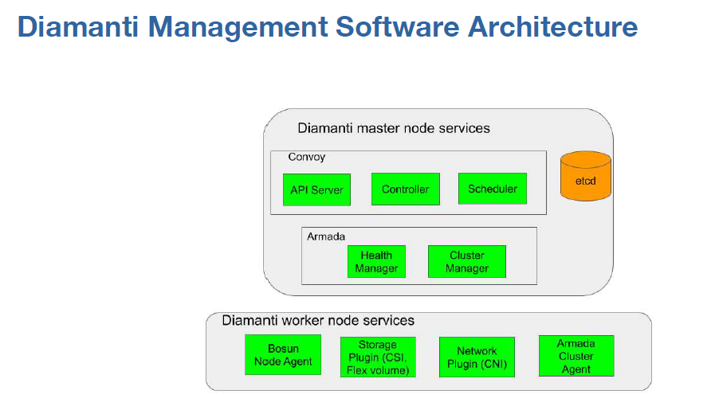
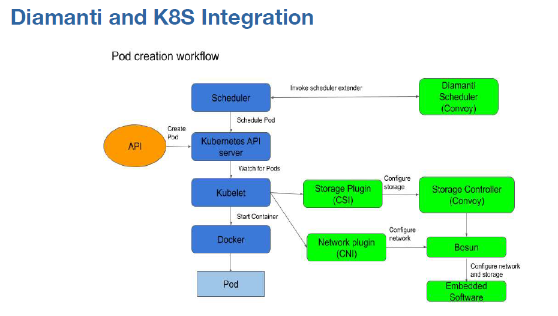

# DIAMANTI Software Architecture
- ### Kubernetes Cluster Master Node는 apiserver, controller manager, scheduler, etcd 실행
- ### Worker Node는 kubelet, kube-proxy, Container Runtime Engine(docker) 실행

- ### Diamanti는 추가로 Master Node Armada, Bosun, Convoy / Worker Node Armada, Bosun 실행
- ### Diamanti는 위 서비스가 Systemd Daemon(systemctl) 형태로 실행

Kubernetes Architecture



Master Role 서버 확인
- Cluster Status의 Server Role로 항목 

```
[diamanti@dia01 ~]$ dctl cluster status
Name            : spkcluster
UUID            : c6d720dc-9bce-11ea-b3d2-a4bf014f87ff
State           : Created
Version         : 2.4.0 (60)
Etcd State      : Healthy
Virtual IP      : 192.168.200.100
Storage VLAN    : 200
Pod DNS Domain  : cluster.local

NAME      NODE-STATUS   K8S-STATUS   ROLE      MILLICORES   MEMORY           STORAGE           IOPS       VNICS     BANDWIDTH   SCTRLS          LABELS
                                                                                                                                LOCAL, REMOTE
dia01     Good          Good         master    3300/40000   9.73GiB/128GiB   1.06TB/3.05TB     30K/500K   6/63      1G/36G      1/64, 1/64      beta.diamanti.com/runc=true,beta.diamanti.com/runtime-engine=docker,beta.kubernetes.io/arch=amd64,beta.kubernetes.io/os=linux,kubernetes.io/arch=amd64,kubernetes.io/hostname=dia01,kubernetes.io/os=linux
dia02     Good          Good         master    200/40000    1.12GiB/128GiB   902.16GB/3.05TB   20K/500K   6/63      1G/36G      1/64, 1/64      beta.diamanti.com/runc=true,beta.diamanti.com/runtime-engine=docker,beta.kubernetes.io/arch=amd64,beta.kubernetes.io/os=linux,kubernetes.io/arch=amd64,kubernetes.io/hostname=dia02,kubernetes.io/os=linux
dia03     Good          Good         master    300/40000    1.18GiB/128GiB   1.37TB/3.05TB     0/500K     5/63      500M/36G    0/64, 0/64      beta.diamanti.com/runc=true,beta.diamanti.com/runtime-engine=docker,beta.kubernetes.io/arch=amd64,beta.kubernetes.io/os=linux,kubernetes.io/arch=amd64,kubernetes.io/hostname=dia03,kubernetes.io/os=linux
dia04     Good          Good         worker    110/40000    66MiB/128GiB     1.47TB/3.05TB     0/500K     7/63      500M/36G    0/64, 0/64      beta.diamanti.com/runc=true,beta.diamanti.com/runtime-engine=docker,beta.kubernetes.io/arch=amd64,beta.kubernetes.io/os=linux,kubernetes.io/arch=amd64,kubernetes.io/hostname=dia04,kubernetes.io/os=linux
```

Diamanti Cluster는 API, Controller, Scheduler 등의 주요 Kubernetes Master Node Component가 Systemd 데몬으로 실행
```
[diamanti@dia01 ~]$ systemctl status apiserver.service
● apiserver.service - Kubernetes API Server
   Loaded: loaded (/usr/lib/systemd/system/apiserver.service; disabled; vendor preset: disabled)
   Active: active (running) since Fri 2020-05-22 10:51:53 KST; 3 weeks 4 days ago
 Main PID: 24051 (kube-apiserver)
    Tasks: 86
   Memory: 479.1M
   CGroup: /system.slice/apiserver.service
           └─24051 /usr/bin/kube-apiserver --logtostderr=true --stderrthreshold=0 --audit-log-path=/var/log/diamanti/apiserver_audit.log --audit-lo...

Jun 17 09:24:11 dia01 kube-apiserver[24051]: I0617 09:24:11.893172   24051 controller.go:107] OpenAPI AggregationController: Processing ite...s.k8s.io
Jun 17 09:25:11 dia01 kube-apiserver[24051]: I0617 09:25:11.897297   24051 controller.go:107] OpenAPI AggregationController: Processing ite...s.k8s.io
Jun 17 09:26:11 dia01 kube-apiserver[24051]: I0617 09:26:11.901354   24051 controller.go:107] OpenAPI AggregationController: Processing ite...s.k8s.io
Jun 17 09:27:11 dia01 kube-apiserver[24051]: I0617 09:27:11.905519   24051 controller.go:107] OpenAPI AggregationController: Processing ite...s.k8s.io
Jun 17 09:28:11 dia01 kube-apiserver[24051]: I0617 09:28:11.908987   24051 controller.go:107] OpenAPI AggregationController: Processing ite...s.k8s.io
Jun 17 09:29:11 dia01 kube-apiserver[24051]: I0617 09:29:11.913070   24051 controller.go:107] OpenAPI AggregationController: Processing ite...s.k8s.io
Jun 17 09:30:11 dia01 kube-apiserver[24051]: I0617 09:30:11.916609   24051 controller.go:107] OpenAPI AggregationController: Processing ite...s.k8s.io
Jun 17 09:30:12 dia01 kube-apiserver[24051]: E0617 09:30:12.584518   24051 watcher.go:214] watch chan error: etcdserver: mvcc: required rev...ompacted
Jun 17 09:31:11 dia01 kube-apiserver[24051]: I0617 09:31:11.919649   24051 controller.go:107] OpenAPI AggregationController: Processing ite...s.k8s.io
Jun 17 09:32:11 dia01 kube-apiserver[24051]: I0617 09:32:11.923930   24051 controller.go:107] OpenAPI AggregationController: Processing ite...s.k8s.io
Hint: Some lines were ellipsized, use -l to show in full.

[diamanti@dia01 ~]$ systemctl status controller-manager.service
● controller-manager.service - Kubernetes Controller Manager
   Loaded: loaded (/usr/lib/systemd/system/controller-manager.service; disabled; vendor preset: disabled)
   Active: active (running) since Fri 2020-05-22 10:51:53 KST; 3 weeks 4 days ago
 Main PID: 24052 (kube-controller)
    Tasks: 89
   Memory: 208.8M
   CGroup: /system.slice/controller-manager.service
           └─24052 /usr/bin/kube-controller-manager --kubeconfig=/etc/kubernetes/kubeconfig --logtostderr=true --stderrthreshold=0 --v=2 --master=h...

Jun 17 09:32:33 dia01 kube-controller-manager[24052]: E0617 09:32:33.912522   24052 reflector.go:125] k8s.io/client-go/dynamic/dynamicinform...esource
Jun 17 09:32:34 dia01 kube-controller-manager[24052]: E0617 09:32:34.911995   24052 reflector.go:125] k8s.io/client-go/dynamic/dynamicinform...esource
Jun 17 09:32:34 dia01 kube-controller-manager[24052]: E0617 09:32:34.912738   24052 reflector.go:125] k8s.io/client-go/dynamic/dynamicinform...esource
Jun 17 09:32:34 dia01 kube-controller-manager[24052]: E0617 09:32:34.913919   24052 reflector.go:125] k8s.io/client-go/dynamic/dynamicinform...esource
Jun 17 09:32:35 dia01 kube-controller-manager[24052]: E0617 09:32:35.913180   24052 reflector.go:125] k8s.io/client-go/dynamic/dynamicinform...esource
Jun 17 09:32:35 dia01 kube-controller-manager[24052]: E0617 09:32:35.913722   24052 reflector.go:125] k8s.io/client-go/dynamic/dynamicinform...esource
Jun 17 09:32:35 dia01 kube-controller-manager[24052]: E0617 09:32:35.915064   24052 reflector.go:125] k8s.io/client-go/dynamic/dynamicinform...esource
Jun 17 09:32:36 dia01 kube-controller-manager[24052]: E0617 09:32:36.914380   24052 reflector.go:125] k8s.io/client-go/dynamic/dynamicinform...esource
Jun 17 09:32:36 dia01 kube-controller-manager[24052]: E0617 09:32:36.915062   24052 reflector.go:125] k8s.io/client-go/dynamic/dynamicinform...esource
Jun 17 09:32:36 dia01 kube-controller-manager[24052]: E0617 09:32:36.916255   24052 reflector.go:125] k8s.io/client-go/dynamic/dynamicinform...esource
Hint: Some lines were ellipsized, use -l to show in full.

[diamanti@dia01 ~]$ systemctl status scheduler.service
● scheduler.service - Kubernetes Scheduler
   Loaded: loaded (/usr/lib/systemd/system/scheduler.service; disabled; vendor preset: disabled)
   Active: active (running) since Fri 2020-05-22 10:51:53 KST; 3 weeks 4 days ago
 Main PID: 24053 (kube-scheduler)
    Tasks: 55
   Memory: 63.1M
   CGroup: /system.slice/scheduler.service
           └─24053 /usr/bin/kube-scheduler --kubeconfig=/etc/kubernetes/kubeconfig --logtostderr=true --stderrthreshold=0 --v=2 --master=http://127...

Jun 16 16:58:32 dia01 kube-scheduler[24053]: I0616 16:58:32.830258   24053 scheduler.go:593] pod instavote/vote-7b4c45f68d-56vcv is bound s...feasible
Jun 16 16:58:32 dia01 kube-scheduler[24053]: I0616 16:58:32.896630   24053 scheduler.go:593] pod instavote/vote-7b4c45f68d-w8d47 is bound s...feasible
Jun 16 16:58:32 dia01 kube-scheduler[24053]: I0616 16:58:32.962442   24053 scheduler.go:593] pod instavote/vote-7b4c45f68d-8c9sr is bound s...feasible
Jun 16 16:59:15 dia01 kube-scheduler[24053]: I0616 16:59:15.450600   24053 scheduler.go:593] pod instavote/vote-7b4c45f68d-9gcsn is bound s...feasible
Jun 16 17:03:40 dia01 kube-scheduler[24053]: I0616 17:03:40.683569   24053 scheduler.go:593] pod instavote/vote-6c7c9f65fb-zvwqg is bound s...feasible
Jun 16 17:03:40 dia01 kube-scheduler[24053]: I0616 17:03:40.756602   24053 scheduler.go:593] pod instavote/vote-6c7c9f65fb-58kc4 is bound s...feasible
Jun 16 17:03:40 dia01 kube-scheduler[24053]: I0616 17:03:40.829742   24053 scheduler.go:593] pod instavote/vote-6c7c9f65fb-sshl6 is bound s...feasible
Jun 16 17:04:23 dia01 kube-scheduler[24053]: I0616 17:04:23.194285   24053 scheduler.go:593] pod instavote/vote-6c7c9f65fb-bt7gl is bound s...feasible
Jun 16 17:07:58 dia01 kube-scheduler[24053]: I0616 17:07:58.312136   24053 scheduler.go:593] pod instavote/redis-c4c646c54-qmw4s is bound s...feasible
Jun 16 17:07:58 dia01 kube-scheduler[24053]: I0616 17:07:58.389749   24053 scheduler.go:593] pod instavote/redis-c4c646c54-5xvc5 is bound s...feasible
Hint: Some lines were ellipsized, use -l to show in full.

[diamanti@dia01 ~]$ systemctl status etcd.service
● etcd.service - Etcd Server
   Loaded: loaded (/usr/lib/systemd/system/etcd.service; disabled; vendor preset: disabled)
   Active: active (running) since Fri 2020-05-22 10:51:41 KST; 3 weeks 4 days ago
 Main PID: 23566 (etcd)
    Tasks: 85
   Memory: 395.8M
   CGroup: /system.slice/etcd.service
           └─23566 /usr/bin/etcd --name dia01 --peer-trusted-ca-file /etc/diamanti/certs/cluster/ca.crt --peer-client-cert-auth --peer-cert-file /e...

Jun 17 09:12:32 dia01 etcd[23566]: store.index: compact 5073046
Jun 17 09:12:32 dia01 etcd[23566]: finished scheduled compaction at 5073046 (took 1.954622ms)
Jun 17 09:17:32 dia01 etcd[23566]: store.index: compact 5073723
Jun 17 09:17:32 dia01 etcd[23566]: finished scheduled compaction at 5073723 (took 2.071571ms)
Jun 17 09:22:32 dia01 etcd[23566]: store.index: compact 5074394
Jun 17 09:22:32 dia01 etcd[23566]: finished scheduled compaction at 5074394 (took 2.341649ms)
Jun 17 09:27:32 dia01 etcd[23566]: store.index: compact 5075070
Jun 17 09:27:32 dia01 etcd[23566]: finished scheduled compaction at 5075070 (took 2.236972ms)
Jun 17 09:32:32 dia01 etcd[23566]: store.index: compact 5075743
Jun 17 09:32:32 dia01 etcd[23566]: finished scheduled compaction at 5075743 (took 1.400708ms)
```

Diamanti S/W Architecture
- Default Kubernetes Master Component 이 외 추가로 Master : armada, bosun, convoy / Worker : armada, bosun 실행 중 
- CPU, Memory 이 외 Storage, Network 상태 추적 용도



```
[diamanti@dia01 ~]$ systemctl status armada.service
● armada.service - DWS cluster server
   Loaded: loaded (/usr/lib/systemd/system/armada.service; enabled; vendor preset: disabled)
   Active: active (running) since Fri 2020-05-22 10:35:13 KST; 3 weeks 4 days ago
 Main PID: 22142 (armada)
    Tasks: 81
   Memory: 90.5M
   CGroup: /system.slice/armada.service
           └─22142 /usr/bin/armada --logtostderr=true --stderrthreshold=0 --v=2 --min-nodes=3 --quorum-size=3 --resource-headroom=10 --etcd-client-...

Jun 16 11:29:08 dia01 armada[22142]: [martini] Started GET /api/v1/cluster for 127.0.0.1:39940
Jun 16 11:29:08 dia01 armada[22142]: [martini] Completed 200 OK in 107.623288ms
Jun 16 13:19:51 dia01 armada[22142]: [martini] Started GET /api/v1/cluster for 127.0.0.1:41496
Jun 16 13:19:51 dia01 armada[22142]: [martini] Completed 200 OK in 125.459332ms
Jun 16 13:20:06 dia01 armada[22142]: [martini] Started GET /api/v1/cluster for 127.0.0.1:41588
Jun 16 13:20:06 dia01 armada[22142]: [martini] Completed 200 OK in 110.681442ms
Jun 16 16:15:08 dia01 armada[22142]: [martini] Started GET /api/v1/cluster for 127.0.0.1:49270
Jun 16 16:15:09 dia01 armada[22142]: [martini] Completed 200 OK in 117.116562ms
Jun 17 09:33:23 dia01 armada[22142]: [martini] Started GET /api/v1/cluster for 127.0.0.1:56470
Jun 17 09:33:23 dia01 armada[22142]: [martini] Completed 200 OK in 115.963689ms

[diamanti@dia01 ~]$ systemctl status bosun.service
● bosun.service - Diamanti Resource Manager
   Loaded: loaded (/usr/lib/systemd/system/bosun.service; static; vendor preset: disabled)
   Active: active (running) since Fri 2020-05-22 10:51:53 KST; 3 weeks 4 days ago
 Main PID: 24121 (bosun)
    Tasks: 53
   Memory: 98.4M
   CGroup: /system.slice/bosun.service
           └─24121 /usr/bin/bosun --logtostderr=true --stderrthreshold=0 --v=2 --event-provider=postgres --broadcast-disable=false

Jun 16 17:08:30 dia01 bosun[24121]: I0616 17:08:30.632085   24121 scdmodule.go:149] [scd]: Received command type: SCD_ADD_QOSTEMPLATE, com...iops":0}}
Jun 16 17:08:30 dia01 bosun[24121]: I0616 17:08:30.632189   24121 skippermodule.go:78] [skipper]: Sending cmd: {"id":1592294910632135647,"...tatus":0}
Jun 16 17:08:30 dia01 bosun[24121]: I0616 17:08:30.632766   24121 skippermodule.go:103] [skipper]: cmd: {"id":1592294910632135647,"command...tatus":0}
Jun 16 17:08:30 dia01 bosun[24121]: I0616 17:08:30.632824   24121 qostemplate_syncer.go:76] Successfully added QOS template: best-effort
Jun 16 17:08:30 dia01 bosun[24121]: [martini] Completed 200 OK in 2.154601375s
Jun 16 17:08:46 dia01 bosun[24121]: I0616 17:08:46.979532   24121 scdmodule.go:111] [scd]: Sending command type: SCD_ADD_QOSTEMPLATE, comm...iops":0}}
Jun 16 17:08:46 dia01 bosun[24121]: I0616 17:08:46.980979   24121 scdmodule.go:149] [scd]: Received command type: SCD_ADD_QOSTEMPLATE, com...iops":0}}
Jun 16 17:08:46 dia01 bosun[24121]: I0616 17:08:46.981088   24121 skippermodule.go:78] [skipper]: Sending cmd: {"id":1592294926981045014,"...tatus":0}
Jun 16 17:08:46 dia01 bosun[24121]: I0616 17:08:46.981704   24121 skippermodule.go:103] [skipper]: cmd: {"id":1592294926981045014,"command...tatus":0}
Jun 16 17:08:46 dia01 bosun[24121]: I0616 17:08:46.981771   24121 qostemplate_syncer.go:76] Successfully added QOS template: best-effort
Hint: Some lines were ellipsized, use -l to show in full.

[diamanti@dia01 ~]$ systemctl status convoy.service
● convoy.service - Convoy server
   Loaded: loaded (/usr/lib/systemd/system/convoy.service; static; vendor preset: disabled)
   Active: active (running) since Fri 2020-05-22 10:51:53 KST; 3 weeks 4 days ago
 Main PID: 24058 (convoy)
    Tasks: 88
   Memory: 170.2M
   CGroup: /system.slice/convoy.service
           └─24058 /usr/bin/convoy --logtostderr=true --stderrthreshold=0 --v=2 --cors-allowed-origins= --cors-allowed-ports=443 --enable-remote-st...

Jun 17 09:33:27 dia01 convoy[24058]: [martini] Started       GET /api/v1/cluster from 192.168.200.101:41716
Jun 17 09:33:27 dia01 convoy[24058]: [martini] Completed 200 GET /api/v1/cluster from 192.168.200.101:41716 time 111.525089ms
Jun 17 09:33:49 dia01 convoy[24058]: [martini] Started GET /api/v1/endpoints for 127.0.0.1:33040
Jun 17 09:33:49 dia01 convoy[24058]: [martini] Completed 200 OK in 17.494444ms
Jun 17 09:34:21 dia01 convoy[24058]: I0617 09:34:21.108595   24058 volume_scheduler.go:1145] Reconciling volumes
Jun 17 09:34:49 dia01 convoy[24058]: [martini] Started GET /api/v1/endpoints for 127.0.0.1:33584
Jun 17 09:34:49 dia01 convoy[24058]: [martini] Completed 200 OK in 20.322178ms
Jun 17 09:35:06 dia01 convoy[24058]: [martini] Started GET /api/v1/endpoints for 192.168.200.104:47704
Jun 17 09:35:06 dia01 convoy[24058]: [martini] Completed 200 OK in 19.3925ms
Jun 17 09:35:21 dia01 convoy[24058]: I0617 09:35:21.113957   24058 volume_scheduler.go:1145] Reconciling volumes
```

Worknode(dia04) 에서는 Convoy Systemd Daemon 실행 중이지 않음 

```
[diamanti@dia04 ~]$ systemctl status convoy.service
● convoy.service - Convoy server
   Loaded: loaded (/usr/lib/systemd/system/convoy.service; static; vendor preset: disabled)
   Active: inactive (dead)
```

Kubernetes POD 생성 Workflow
- Master API Server 통하여 Controller/Scheduler 상태 확인 후 Worker Node Kubelet 통하여 Docker/Pod 생성




