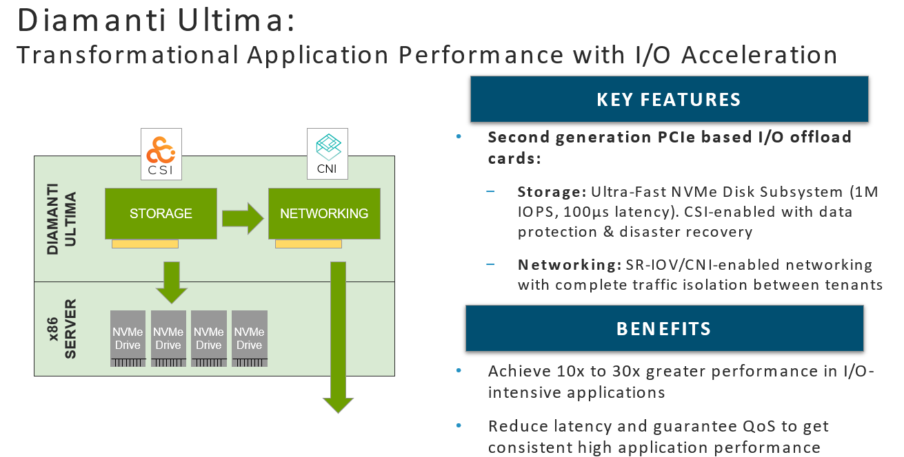

# Kubernetes Volume Mirror
- ### Disk fault, Node fail 등의 상황에서 Volume HA 구성을 위하여 Diamanti는 Node 간 Volume 복제(mirror) 기능 지원
- ### Diamanti는 성능 향상을 위하여 기본적으로 POD와 Volume은 같은 Node에 배치
- ### Mirror Volume은 같은 Cluster 내 다른 Node로 배치
- ### 노드 간 Volume 복제 시 NVMe Over Ethernet Protocol 및 전용 스토리지 네트워크(20G)을 사용하여 고성능 복제 가능

## StorageClass, PVC 생성
소스 코드 : [high2m-sc](./high2m-sc.yml), [high2m-pvc](./high2m-pvc.yml)

Storage Class 생성 시 'mirrorCount'를 '2'로 설정하면 2 Copy Mirror Volume 생성

```
vi high2m-sc.yml

apiVersion: storage.k8s.io/v1
kind: StorageClass
metadata:
  name: high2m
parameters:
  fsType: xfs  ## ext4 등 FileType 선택 가능 
  mirrorCount: "2"  ## Volume mirror 1 or 2 or 3 copy(최대 3) 설정 가능 
  perfTier: high  
provisioner: dcx.csi.diamanti.com  # Diamanti 자체 CSI 제공 
reclaimPolicy: Delete
volumeBindingMode: Immediate
allowVolumeExpansion: true  ## Volume 용량 확장 가능

spkr@erdia22:~/02.k8s/diamanti-k8s-bootcamp/37.VolumeMirror$ kc apply -f high2m-sc.yml
storageclass.storage.k8s.io/high2m unchanged

spkr@erdia22:~/02.k8s/diamanti-k8s-bootcamp/37.VolumeMirror$ kc apply -f high2m-pvc.yml
persistentvolumeclaim/mirror-pvc created
```

## POD Volume 할당
소스 코드 : [date-pvc-deploy](./date-pvc-deploy.yml)

```
vi date-pvc-deploy.yml

(...)
        command:
        - "/bin/sh"
        - "-c"
        - "while true; do date >> /data/pod-out.txt; cd /data; sync; sync; sleep 10; done"
        volumeMounts:
        - name: date-pvc
          mountPath: /data

```

정상적으로 Data가 Mirror 되는지 확인을 위하여 매 10초 마다 'date' 명령어 결과를 '/data/pod-out.txt' 파일로 저장 

## Data 확인
```
spkr@erdia22:~/02.k8s/diamanti-k8s-bootcamp/37.VolumeMirror$ kc exec -it date-mirror-deploy-7c5f85f89d-hfrb6 -- bash
[root@date-mirror-deploy-7c5f85f89d-hfrb6 /]# cat /data/pod-out.txt
Mon Jun 22 06:39:20 UTC 2020
Mon Jun 22 06:39:30 UTC 2020
Mon Jun 22 06:39:40 UTC 2020
Mon Jun 22 06:39:50 UTC 2020
```

## Volume Mirror 구성 확인
```
spkr@erdia22:~/02.k8s/diamanti-k8s-bootcamp/37.VolumeMirror$ dctl volume list
NAME                                       SIZE       NODE            LABELS                                                              PHASE     STATUS      ATTACHED-TO   DEVICE-PATH    PARENT    AGE
(...)
pvc-8b0a5bed-86b0-41c2-9be2-edbcbad7668d   10.77GB    [dia02 dia03]   diamanti.com/pod-name=default/date-mirror-deploy-7c5f85f89d-hfrb6   -         Attached    dia02         /dev/nvme2n1             2m

spkr@erdia22:~/02.k8s/diamanti-k8s-bootcamp/37.VolumeMirror$ dctl volume describe pvc-8b0a5bed-86b0-41c2-9be2-edbcbad7668d
Name                                          : pvc-8b0a5bed-86b0-41c2-9be2-edbcbad7668d
Size                                          : 10.77GB
Encryption                                    : false
Node                                          : [dia02 dia03]
Label                                         : diamanti.com/pod-name=default/date-mirror-deploy-7c5f85f89d-hfrb6
Node Selector                                 : <none>
Phase                                         : Available
Status                                        : Attached
Attached-To                                   : dia02
Device Path                                   : /dev/nvme2n1
Age                                           : 5m
Perf-Tier                                     : high
Mode                                          : Filesystem
Fs-Type                                       : xfs
Scheduled Plexes / Actual Plexes              : 2/2

Plexes:
          NAME                                          NODES     STATE     CONDITION   OUT-OF-SYNC-AGE   RESYNC-PROGRESS   DELETE-PROGRESS
          ----                                          -----     -----     ---------   ---------------   ---------------   ---------------
          pvc-8b0a5bed-86b0-41c2-9be2-edbcbad7668d.p0   dia02     Up        InUse
          pvc-8b0a5bed-86b0-41c2-9be2-edbcbad7668d.p1   dia03     Up        InUse

```

Mirror Volume dia02, dia03 노드 할당

## Volume Mirror 확인 Test
dia02 노드 drain 하여 해당 POD를 다른 노드(dia03)로 실행

```
spkr@erdia22:~/02.k8s/diamanti-k8s-bootcamp/37.VolumeMirror$ kc get pod -o wide
NAME                                  READY   STATUS    RESTARTS   AGE     IP             NODE    NOMINATED NODE   READINESS GATES
date-mirror-deploy-7c5f85f89d-hfrb6   1/1     Running   0          5m27s   10.10.100.14   dia02   <none>           <none>

spkr@erdia22:~/02.k8s/diamanti-k8s-bootcamp/37.VolumeMirror$ kc drain dia02 --ignore-daemonsets --force
node/dia02 already cordoned
WARNING: ignoring DaemonSet-managed Pods: diamanti-system/collectd-v0.8-px5qs, diamanti-system/csi-diamanti-driver-c2xxw, diamanti-system/nfs-csi-diamanti-driver-s4vpz; deleting Pods not managed by ReplicationController, ReplicaSet, Job, DaemonSet or StatefulSet: test/centos7-test
evicting pod "centos7-test"
evicting pod "db-b5d87b8d4-5csvt"
evicting pod "alertmanager-0"
evicting pod "date-mirror-deploy-7c5f85f89d-hfrb6"
evicting pod "vote-6c7c9f65fb-xfwdk"
evicting pod "redis-c4c646c54-qmw4s"
evicting pod "result-849d78dd45-p72jg"
evicting pod "vote-6c7c9f65fb-zvwqg"
evicting pod "coredns-54d89499d4-98lqg"
evicting pod "worker-84cc978fd8-6vvkg"
evicting pod "myingress01-kubernetes-ingress-589649756c-2zwc4"
evicting pod "prometheus-v1-2"
pod/vote-6c7c9f65fb-xfwdk evicted
pod/myingress01-kubernetes-ingress-589649756c-2zwc4 evicted
pod/prometheus-v1-2 evicted
pod/vote-6c7c9f65fb-zvwqg evicted
pod/coredns-54d89499d4-98lqg evicted
pod/db-b5d87b8d4-5csvt evicted
pod/alertmanager-0 evicted
pod/worker-84cc978fd8-6vvkg evicted
pod/centos7-test evicted
pod/date-mirror-deploy-7c5f85f89d-hfrb6 evicted
pod/redis-c4c646c54-qmw4s evicted
pod/result-849d78dd45-p72jg evicted
node/dia02 evicted
```

## POD dia02 -> dia03 실행
dia02에서 실행 중이던 POD가 dia03에서 실행 중
```
spkr@erdia22:~$ kc get pod -o wide
NAME                                  READY   STATUS    RESTARTS   AGE     IP             NODE    NOMINATED NODE   READINESS GATES
date-mirror-deploy-7c5f85f89d-srklb   1/1     Running   0          2m50s   10.10.100.13   dia03   <none>           <none>
```

## Data 확인
dia03 노드로 변경 후 기존 dia02 노드 데이터 그대로 가져오는 지 검증

```
spkr@erdia22:~$ kc exec -it date-mirror-deploy-7c5f85f89d-srklb -- bash
[root@date-mirror-deploy-7c5f85f89d-srklb /]# cat /data/pod-out.txt
Mon Jun 22 06:39:20 UTC 2020
Mon Jun 22 06:39:30 UTC 2020
Mon Jun 22 06:39:40 UTC 2020
Mon Jun 22 06:39:50 UTC 2020
Mon Jun 22 06:40:00 UTC 2020
Mon Jun 22 06:40:10 UTC 2020
Mon Jun 22 06:40:38 UTC 2020
(...)
```

Mirroring 되어 기존 Data 그대로 data 유실 없이 신규 노드 POD에서 확인 가능 


참조

