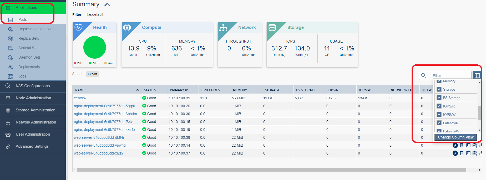

# Kubernetes Performance Monitoring

- ### Kubernetes는 성능 모니터링(cpu, memory, IOPS 등)을 위하여 기본 Package 이 외 별도 Component 설치 필요
- ### Diamanti는 성능 모니터링에 필요한 Metrics, Prometheus, Admin Page 등을 기본 제공함
- ### 성능 확인은 Admin GUI Page 또는 kubectl top {node/pod} 명령어로 확인 가능 

### Collectd POD

```
spkr@erdia22:~/02.k8s/diamanti-k8s-bootcamp/15.Daemonset$ kc get pod -n diamanti-system
NAME                                       READY   STATUS    RESTARTS   AGE
alertmanager-0                             1/1     Running   0          3d5h
collectd-v0.8-6wmw4                        5/5     Running   10         11d
collectd-v0.8-9tl7q                        5/5     Running   0          11d
collectd-v0.8-fxlkh                        5/5     Running   0          11d
collectd-v0.8-twcdb                        5/5     Running   0          11d
csi-diamanti-driver-fjhg6                  2/2     Running   2          11d
csi-diamanti-driver-r796l                  2/2     Running   2          11d
csi-diamanti-driver-rqnvw                  2/2     Running   6          11d
csi-diamanti-driver-xwswm                  2/2     Running   2          11d
csi-external-attacher-6bbc9d4bbd-r297v     1/1     Running   0          3d6h
csi-external-provisioner-957ff6577-29ldk   1/1     Running   0          3d6h
csi-external-resizer-9848cdf68-cpwzn       1/1     Running   0          3d6h
csi-external-snapshotter-8c8959567-2rl85   1/1     Running   2          10d
grafana-84d4cbdb47-g4xpp                   1/1     Running   0          7d6h
nfs-csi-diamanti-driver-hgl5k              2/2     Running   0          11d
nfs-csi-diamanti-driver-pq5mf              2/2     Running   0          11d
nfs-csi-diamanti-driver-sfw54              2/2     Running   0          11d
nfs-csi-diamanti-driver-xvqn4              2/2     Running   4          11d
prometheus-v1-0                            1/1     Running   0          3h5m
prometheus-v1-1                            1/1     Running   0          11d
prometheus-v1-2                            1/1     Running   0          168m
provisioner-7b58589b9d-td4bc               1/1     Running   0          3d6h
snapshot-controller-66fb5f8fbd-kqf7d       2/2     Running   4          10d
```
- ### POD 모니터링 예제
### 부하 생성을 위한 Sample POD/PVC 생성 

소스 코드 : [PVC](./high-pvc.yml)

소스 코드 : [CentOS POD](./centos7-pod.yml)

```
vi high-pvc.yml 

apiVersion: v1
kind: PersistentVolumeClaim
metadata:
  name: perf-pvc
spec:
  accessModes:
  - ReadWriteOnce
  resources:
    requests:
      storage: 10Gi
  storageClassName: high

vi centos7-pod.yml

apiVersion: v1
kind: Pod
metadata:
  annotations:
    diamanti.com/endpoint0: '{"network":"blue","perfTier":"high"}'
  name: centos7
  namespace: default
  labels:
    run: centos7
spec:
  containers:
  - name: centos7
    image: centos:7
    command:
      - "/bin/sh"
      - "-c"
      - "sleep inf"
    volumeMounts:
      - mountPath: /data
        name: perf-vol
  volumes:
  - name: perf-vol
    persistentVolumeClaim:
      claimName: perf-pvc
```

### 부하 생성 툴 fio 설치(yum)
```
spkr@erdia22:~/02.k8s/diamanti-k8s-bootcamp/17.PerfMonitoring$ kc exec -it centos7 -- bash
[root@centos7 /]# yum -y install fio
Loaded plugins: fastestmirror, ovl
(...)
```

### FIO 설정 파일

소스 코드 : [FIO 예시 파일](./randread.fio)
: 60초 동안, 16개 작업 실행

```
vi randread.fio

[global]
ioengine=libaio
rw=randrw
numjobs=16
direct=1
bs=4k
filename=/data/testfile
runtime=60
time_based=1
iodepth=16
size=5g
group_reporting
rwmixread=100
rwmixwrite=0
[read]
```
미리 /data/testfile 파일을 만들어준다.. 


### 부하 생성 및 부하 테스트 결과 예시
### 예제 randread.fio 파일 Copy
```
[root@centos7 /]# fio randread.fio --output /data/randread.out
Jobs: 16 (f=16): [r(16)][14.8%][r=1948MiB/s,w=0KiB/s][r=499k,w=0 IOPS][eta 00m:52s]
(...)

[root@centos7 /]# cat /data/randread.out
read: (g=0): rw=randrw, bs=(R) 4096B-4096B, (W) 4096B-4096B, (T) 4096B-4096B, ioengine=libaio, iodepth=16
...
fio-3.7
Starting 16 processes
read: Laying out IO file (1 file / 5120MiB)

read: (groupid=0, jobs=16): err= 0: pid=153: Fri Jun 19 04:27:42 2020
   read: IOPS=519k, BW=2029MiB/s (2127MB/s)(119GiB/60001msec)
    slat (usec): min=2, max=13429, avg=28.83, stdev=64.04
(...)
```
- READ IOPS 519K 

### Admin GUI Page 성능 확인 

개별 POD 별 성능


- CPU, Memory, Disk 용량 사용량, IOPS(Read/Write), Latency(Read/Write), Bandwidth(Rx/Tx) 등 상세 정보 확인 가능 

시계열 성능 그래프


### kubectl top 

전체 혹은 개별 단위 POD, Node 단위 CPU, Memory 성능 조회

```
spkr@erdia22:/mnt/c/Users/erdia$ kc top pod centos7
NAME      CPU(cores)   MEMORY(bytes)
centos7   8810m        77Mi

spkr@erdia22:/mnt/c/Users/erdia$ kc top pod
NAME                                CPU(cores)   MEMORY(bytes)
centos7                             8810m        77Mi
nginx-deployment-6c9b7977db-5grpk   0m           1Mi
nginx-deployment-6c9b7977db-6bhdm   0m           1Mi
nginx-deployment-6c9b7977db-f64vt   0m           1Mi
nginx-deployment-6c9b7977db-sks4x   0m           1Mi
web-server-846dbbd6dd-dk94r         0m           22Mi
web-server-846dbbd6dd-vpwnq         0m           22Mi
web-server-846dbbd6dd-xl2z7         0m           21Mi

spkr@erdia22:/mnt/c/Users/erdia$ kc top node
NAME    CPU(cores)   CPU%   MEMORY(bytes)   MEMORY%
dia01   2649m        6%     19644Mi         15%
dia02   582m         1%     11167Mi         8%
dia03   540m         1%     12257Mi         9%
dia04   458m         1%     9833Mi          7%```
```
