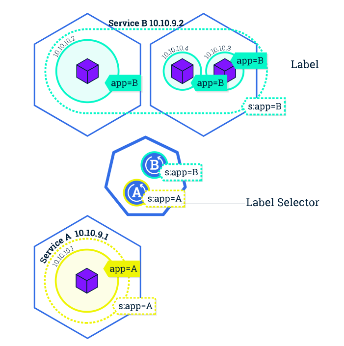

# Kubernetes Label

- ### Kubernetes에서 서로 다른 Object가 서로 선택 또는 구분 할 수 있도록 Naming하는 방법 (Label, 상표). 예를 들어 Service에서 POD를 선택하는 경우 Label 정보를 이용

Kubernetes Label


소스 코드 : [Deploy YAML](15.Label/nginxhello-deploy.yml)

소스 코드 : [Service YAML](./headless-svc.yml)

```
vi headless-svc.yml

(...)
  selector:  # 선택해야 할 POD 선택
    app: web  # POD Label 동일

vi nginxhello-deploy.yml

(...)
metadata:
  name: nginx-deployment
  labels:
    app: web  # Service 등에서 참조할 Label 이름 

spkr@erdia22:~/02.k8s/diamanti-k8s-bootcamp/15.Label$ kc apply -f headless-svc.yml
service/web-svc configured

spkr@erdia22:~/02.k8s/diamanti-k8s-bootcamp/15.Label$ kc apply -f nginxhello-deploy.yml
deployment.apps/nginx-deployment created

```
Service Selector에서 지정한 label(app: web)과 Deployment의 label 정보(app: web)가 일치하므로 Service와 Deployment 연결됨 
- POD IP 10.10.100.37 Service Endpoints로 등록됨 
```
spkr@erdia22:~/02.k8s/diamanti-k8s-bootcamp/15.Label$ kc get pod -o wide
NAME                                READY   STATUS        RESTARTS   AGE   IP             NODE    NOMINATED NODE   READINESS GATES
nginx-deployment-6c55bc594b-bql2r   1/1     Running       0          11m   10.10.100.37   dia01   <none>           <none>

spkr@erdia22:~/02.k8s/diamanti-k8s-bootcamp/15.Label$ kc describe svc web-svc
Name:              web-svc
Namespace:         default
Labels:            <none>
Annotations:       kubectl.kubernetes.io/last-applied-configuration:
                     {"apiVersion":"v1","kind":"Service","metadata":{"annotations":{},"name":"web-svc","namespace":"default"},"spec":{"clusterIP":"None","ports...
Selector:          app=web
Type:              ClusterIP
IP:                None
Port:              tcp  80/TCP
TargetPort:        80/TCP
Endpoints:         10.10.100.37:80
Session Affinity:  None
Events:            <none>
```

Object 별 label 정보는 --show-labels 옵션으로 확인 가능 
```
spkr@erdia22:~/02.k8s/diamanti-k8s-bootcamp/15.Label$ kc get pod nginx-deployment-6c55bc594b-bql2r --show-labels
NAME                                READY   STATUS    RESTARTS   AGE   LABELS
nginx-deployment-6c55bc594b-bql2r   1/1     Running   0          13m   app=web,pod-template-hash=6c55bc594b

spkr@erdia22:~/02.k8s/diamanti-k8s-bootcamp/15.Label$ kc get svc web-svc --show-labels
NAME      TYPE        CLUSTER-IP   EXTERNAL-IP   PORT(S)   AGE    LABELS
web-svc   ClusterIP   None         <none>        80/TCP    2d3h   <none>

spkr@erdia22:~/02.k8s/diamanti-k8s-bootcamp/15.Label$ kc get deployments. nginx-deployment --show-labels
NAME               READY   UP-TO-DATE   AVAILABLE   AGE   LABELS
nginx-deployment   1/1     1            1           15m   app=web
```

전체 label 정보 조회 
```
spkr@erdia22:~/02.k8s/diamanti-k8s-bootcamp/42.Kafka/kafka-bitnami$ kubectl get pods --show-labels -A
NAMESPACE             NAME                                                     READY   STATUS      RESTARTS   AGE     LABELS
argocd                argocd-application-controller-d9dc84865-tjc9f            1/1     Running     3          10d     app.kubernetes.io/name=argocd-application-controller,pod-template-hash=d9dc84865
argocd                argocd-dex-server-7c764db67f-zz52s                       1/1     Running     0          10d     app.kubernetes.io/name=argocd-dex-server,pod-template-hash=7c764db67f
argocd                argocd-redis-8486557ddf-46hbx                            1/1     Running     0          10d     app.kubernetes.io/name=argocd-redis,pod-template-hash=8486557ddf
```

동일하게 Node 등 다른 Kubernetes Object Label 정보도 동일 명령어로 확인 가능
- 향후 Node Affinity Scheduling에 사용
```
spkr@erdia22:~/02.k8s/diamanti-k8s-bootcamp/15.Label$ kc get nodes dia01 --show-labels
NAME    STATUS   ROLES    AGE   VERSION    LABELS
dia01   Ready    <none>   26d   v1.15.10   beta.diamanti.com/runc=true,beta.diamanti.com/runtime-engine=docker,beta.kubernetes.io/arch=amd64,beta.kubernetes.io/os=linux,kubernetes.io/arch=amd64,kubernetes.io/hostname=dia01,kubernetes.io/os=linux
```
