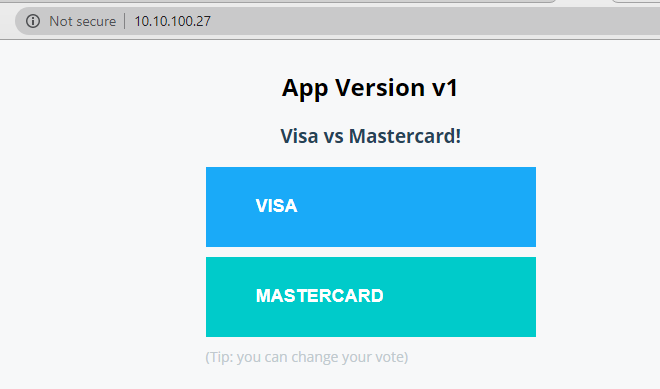
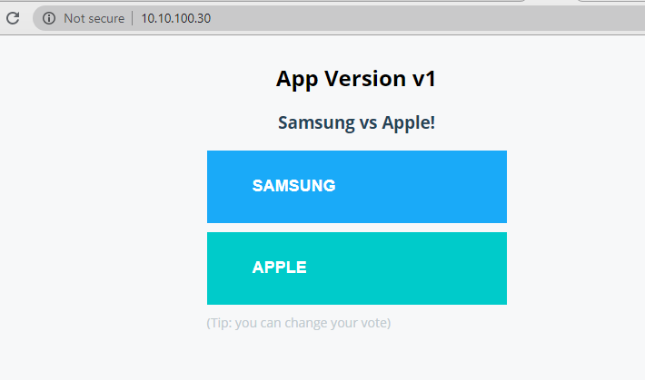

# Kubernetes ConfigMap

- ### Kubernetes는 MySQL Port, 변수 등의 Application 설정 관련 정보를 별도의 ConfigMap이라는 Kubernetes Object로 관리

### ConfigMap 예제
- configmap 생성

소스 코드 : [ConfigMap](./vote-cm.yml)

```
vi vote-cm.yml

apiVersion: v1
kind: ConfigMap
metadata:
  name: vote
data:
  OPTION_A: Visa
  OPTION_B: Mastercard

kc apply -f vote-cm.yml

spkr@erdia22:~/02.k8s_code/13.ConfigMap$ kc get cm
NAME   DATA   AGE
vote   2      6m27s

spkr@erdia22:~/02.k8s_code/13.ConfigMap$ kc describe cm vote
Name:         vote
Namespace:    default
Labels:       <none>
Annotations:  kubectl.kubernetes.io/last-applied-configuration:
                {"apiVersion":"v1","data":{"OPTION_A":"Visa","OPTION_B":"Mastercard"},"kind":"ConfigMap","metadata":{"annotations":{},"name":"vote","names...

Data
====
OPTION_A:
----
Visa
OPTION_B:
----
Mastercard
Events:  <none>
```

ConfigMap from file 

```
spkr@erdia22:~/12.k8s_code/61.PJT/01.MariaDB-DZ$ kc create cm mariadb-cm -n test --from-file=my.cnf
configmap/mariadb-cm created

spkr@erdia22:~/12.k8s_code/61.PJT/01.MariaDB-DZ$ kc get cm -n test
NAME                                DATA   AGE
helm-mariadb-galera-configuration   1      7d9h
helm-mariadb-galera-tests           1      7d9h
mariadb-cm                          1      68s
mariadb-exporter-cm                 1      8s
```

### POD ConfigMap 사용 
- YAML 파일 envFrom, configMapRef 추가 후 configMap 이름 지정 

소스 코드 : [Vote-CM-Deploy](./vote-cm-deploy.yml)
```
vi vote-cm-deploy.yml

(...)
    spec:
      containers:
      - image: schoolofdevops/vote
        imagePullPolicy: Always
        name: vote
        envFrom:  # envFrom 사용 
          - configMapRef:  
              name: vote  # ConfigMap 이름 지정
        ports:
        - containerPort: 80
          protocol: TCP

(...)

kc apply -f vote-cm-deploy.yml
```

POD 내 ConfigMap 정보 확인 가능 
```
spkr@erdia22:~/02.k8s_code/13.ConfigMap$ curl 10.10.100.27|grep class
  % Total    % Received % Xferd  Average Speed   Time    Time     Time  Current
                                 Dload  Upload   Total   Spent    Left  Speed
100  1345  100  1345    0     0  20692      0 --:--:-- --:--:-- --:--:-- 20378
          <button id="a" type="submit" name="vote" class="a" value="a">Visa</button>
          <button id="b" type="submit" name="vote" class="b" value="b">Mastercard</button>
```
ScreenShot 화면



### ConfigMap 수정
- ConfigMap 수정은 1) YAML 또는 2) kubectl edit 명령어로 가능

  아래는 kubectl edit 명령어 예제(vi editor와 동일)

```
spkr@erdia22:~/02.k8s_code/13.ConfigMap$ kc edit cm vote
configmap/vote edited

apiVersion: v1
data:
  OPTION_A: Samsung  # VISA to Samsung
  OPTION_B: Apple  # MASTERCARD to Apple
kind: ConfigMap
metadata:
  annotations:
    kubectl.kubernetes.io/last-applied-configuration: |
      {"apiVersion":"v1","data":{"OPTION_A":"Visa","OPTION_B":"Mastercard"},"kind":"ConfigMap","metadata":{"annotations":{},"name":"vote","namespace":"default"}}
  creationTimestamp: "2020-06-16T04:32:51Z"
  name: vote
  namespace: default
  resourceVersion: "4913411"
  selfLink: /api/v1/namespaces/default/configmaps/vote
  uid: 17df2381-ecad-48f9-854a-57195cbb4ede
  
spkr@erdia22:~/02.k8s_code/13.ConfigMap$ kc describe cm vote
Name:         vote
Namespace:    default
Labels:       <none>
Annotations:  kubectl.kubernetes.io/last-applied-configuration:
                {"apiVersion":"v1","data":{"OPTION_A":"Visa","OPTION_B":"Mastercard"},"kind":"ConfigMap","metadata":{"annotations":{},"name":"vote","names...

Data
====
OPTION_A:
----
Samsung
OPTION_B:
----
Apple
Events:  <none>
```

### 변경된 ConfigMap POD 적용
- ConfigMap 적용을 위해서는 POD Restart 필요

```
spkr@erdia22:~/02.k8s_code/13.ConfigMap$ kc delete pod vote-588576fc88-gzwrm
pod "vote-588576fc88-gzwrm" deleted

spkr@erdia22:~/02.k8s_code/13.ConfigMap$ kc get pod
NAME                    READY   STATUS    RESTARTS   AGE
simple-webapp-color     1/1     Running   0          40m
vote-588576fc88-z5f65   1/1     Running   0          34s
```

변경된 ConfigMap 적용 스크린샷



POD 접속 후 환경 변수 정보로 확인도 가능
```
spkr@erdia22:~/02.k8s_code/13.ConfigMap$ kc exec -it vote-588576fc88-z5f65 -- sh
/app # echo $OPTION_A
Samsung
/app # echo $OPTION_B
Apple
```
