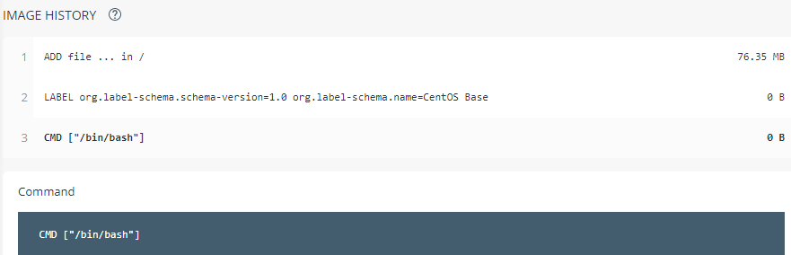

# Kubernetes POD Command
- ### POD 실행 시 수행하는 명령어(command process)를 POD YAML 파일에 정의 가능
  ### 예를 들어 CentOS POD 실행 시 Command를 추가하지 않으면 바로 종료(completed) 되나
  ### Sleep Command 추가하면 Process 실행(running) 상태를 유지하여 종료되지 않음 

### POD without Command
```
spkr@erdia22:~/02.k8s/diamanti-k8s-bootcamp$ kc create deployment busybox --image=busybox
deployment.apps/busybox created

Busybox POD 실행 시 Running 상태가 아니라 Completed 상태로 바로 종료되어 Exec(접속)등이 불가능

spkr@erdia22:~/02.k8s/diamanti-k8s-bootcamp$ kc get pod
NAME                              READY   STATUS              RESTARTS   AGE
busybox-6c5b64fb4f-4d86h          0/1     CrashLoopBackOff    3          100s

spkr@erdia22:~/02.k8s/diamanti-k8s-bootcamp$ kc describe pod busybox-6c5b64fb4f-4d86h
Name:           busybox-6c5b64fb4f-4d86h

(...)

    State:          Waiting
      Reason:       CrashLoopBackOff
    Last State:     Terminated
      Reason:       Completed

(...)
```

소스 코드 : [POD Without Command](./centos-wo-command-pod.yml)
```
vi centos-wo-command-pod.yml

apiVersion: v1
kind: Pod
metadata:
  annotations:
    diamanti.com/endpoint0: '{"network":"blue","perfTier":"high"}'
  name: centos7-wo-command
  labels:
    run: centos7
spec:
  containers:
  - name: centos7
    image: centos:7
    
kc apply -f centos-wo-command-pod.yml

spkr@erdia22:~/02.k8s_code/01.POD$ kc get pod
NAME                         READY   STATUS      RESTARTS   AGE
busybox                      1/1     Running     0          31m
centos7-wo-command           0/1     Completed   2          29s
secret-simple-webapp-color   1/1     Running     0          19h
vote-588576fc88-z5f65        1/1     Running     0          21h
```

- Command 옵션을 사용하지 않는 경우 CentOS POD 실행 후 바로 종료(completed)됨

### POD With Command
소스 코드 : [POD With Command](./centos-command-pod.yml)
```
vi centos-command-pod.yml

apiVersion: v1
kind: Pod
metadata:
  annotations:
    diamanti.com/endpoint0: '{"network":"blue","perfTier":"high"}'
  name: centos7-command
  labels:
    run: centos7
spec:
  containers:
  - name: centos7
    image: centos:7
    command:
      - "/bin/sh"
      - "-c"
      - "sleep inf"

kc apply -f centos-command-pod.yml

spkr@erdia22:~/02.k8s_code/01.POD$ kc get pod
NAME                         READY   STATUS             RESTARTS   AGE
busybox                      1/1     Running            0          48m
centos7-command              1/1     Running            0          12m
centos7-wo-command           0/1     CrashLoopBackOff   8          16m
secret-simple-webapp-color   1/1     Running            0          20h
vote-588576fc88-z5f65        1/1     Running            0          21h

```
- Sleep Command 추가하여 실행(Running) 상태 유지, sleep inf(infinite, 무한대) process 실행 중

```
spkr@erdia22:~/02.k8s_code/01.POD$ kc exec -it centos7-command -- bash
[root@centos7-command /]# ps aux |grep sleep
root          1  0.0  0.0   4364   352 ?        Ss   02:15   0:00 sleep inf
root         24  0.0  0.0   9092   672 ?        S+   02:29   0:00 grep --color=auto sleep
```

### CentOS 기본 도커 이미지 Dockerfile은 bash 명령어만 실행

[CentOS 도커 허브](https://hub.docker.com/layers/centos/library/centos/7/images/sha256-83b1b35d9f3d1ff67998216b8b9c898470e055c693fbeae2494346d6a7e69dbb?context=explore)



