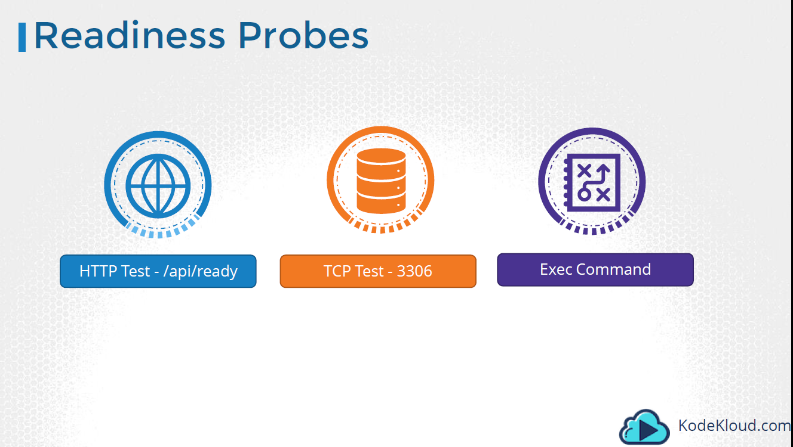

# Kubernetes Liveness Readiness Probe
- ### 컨테이너 Hang 등의 상황으로 Process는 실행 중이나 정상 실행 중이지 않을 경우 컨테이너 강제 Restart하는 기능(liveness Probe)
- ### 컨테이너가 서비스를 받을 준비가 되어 있지 않으면 외부 서비스로 부터 Requests를 받지 않도록 하는 기능(readiness Probe)

### Liveness Probe
소스 코드 : [http-liveness-pod](./http-liveness-pod.yml)

```
vi http-liveness-pod.yml
(...) 
    livenessProbe:
      httpGet:
        path: /healthz
        port: 8080
        httpHeaders:
        - name: Custom-Header
          value: Awesome
      initialDelaySeconds: 3
      periodSeconds: 3
      
```
HTTP Response가 정해진 조건을 만족하지 않으면 POD Restart 실행 

```
spkr@erdia22:~/02.k8s/diamanti-k8s-bootcamp$ kc get pod
NAME            READY   STATUS             RESTARTS   AGE
goproxy         1/1     Running            0          29m
liveness-http   0/1     CrashLoopBackOff   13         28m

spkr@erdia22:~/02.k8s/diamanti-k8s-bootcamp$ kc describe pod liveness-http
Name:         liveness-http
(...) 
    Liveness:       http-get http://:8080/healthz delay=3s timeout=1s period=3s #success=1 #failure=3

(...)
  Warning  Unhealthy  24m (x9 over 25m)    kubelet, dia02     Liveness probe failed: HTTP probe failed with statuscode: 500
  Normal   Killing    24m (x3 over 25m)    kubelet, dia02     Container liveness failed liveness probe, will be restarted
  Warning  BackOff    17s (x103 over 24m)  kubelet, dia02     Back-off restarting failed container
```

Http 500 Error로 POD Restart 실행 후 Error 상태

### Readiness Probe
소스 코드 : [tcp-read-live-probe-pod](./tcp-read-live-probe-pod.yml)

```
vi tcp-read-live-probe-pod.yml
(...)
    readinessProbe:
      tcpSocket:
        port: 8080
      initialDelaySeconds: 5  # 최초 5초간 Delay
      periodSeconds: 10  # Probe 체크 시간 간격 
```

HTTP Request가 아닌 TCP Socket 응답으로 체크

해당 Request가 정상적이지 않을 경우 외부 서비스로 부터 응답을 받지 않음 

```
spkr@erdia22:~/02.k8s/diamanti-k8s-bootcamp$ kc describe pod goproxy
Name:         goproxy
(...)
    Liveness:       tcp-socket :8080 delay=15s timeout=1s period=20s #success=1 #failure=3
    Readiness:      tcp-socket :8080 delay=5s timeout=1s period=10s #success=1 #failure=3
```

Readiness Option

: POD 실행 후 5초 Delay(delay=5s), 1초 안에 응답이 없을 경우(timeout=1s) 

: 10초 간격 실행(period=10s), 성공 count(1회)/실패 count(3회), 3회 실패일 경우 Failure 상태

### Liveness, Readiness Probe 3가지 옵션


HTTP / TCP / Exec(명령어 실행) 3가지 옵션 사용 가능 
