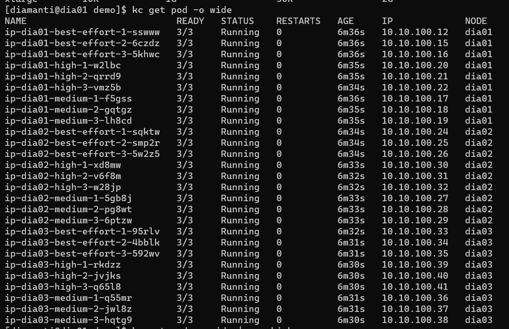
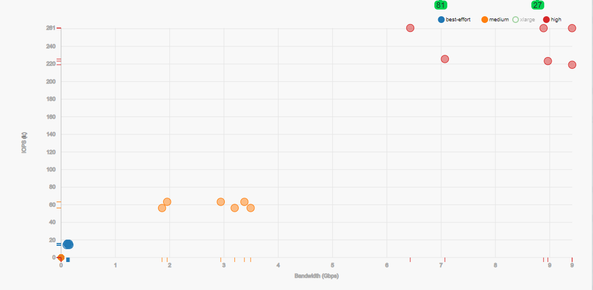

# Diamanti Performance Tier
- ### Diamanti는 운영 중 다른 POD Resource 사용량에 영향을 받지 않도록 개별 POD 별 QoS(Quality of Service) 보장 기능 제공
- ### Performance Tier 형태로 사용되며 Minimum/Maximum IOPS, Bandwidth 설정 가능

Noisyneighborhood 


### Performance Tier 조회
```
spkr@erdia22:~/hosts$ dctl perf-tier list
NAME          STORAGE IOPS   NETWORK BANDWIDTH   MAX STORAGE IOPS   MAX NETWORK BANDWIDTH   LABELS
best-effort   0              0                   -                  -                       diamanti.com/template=true
high          20k            500M                -                  -                       diamanti.com/template=true
medium        5k             125M                -                  -                       diamanti.com/template=true
```
Default 로 best-effort/medium/high 3가지 Type 제공 

### Performance Tier 생성
- 예제 help 명령어 참고

```
spkr@erdia22:~/02.k8s_code/14.secret$ dctl perf-tier create
Error: example usage -  dctl perf-tier create perf-tier1 -i 1k -b 1G -l type=backend
   storage IOPS should be in kilobytes
   Network bandwidth should be in gigabytes

spkr@erdia22:~/02.k8s_code/14.secret$ dctl perf-tier create large -i 1k -I 10K  -b 0.5G -B 2G
NAME      STORAGE IOPS   NETWORK BANDWIDTH   MAX STORAGE IOPS   MAX NETWORK BANDWIDTH   LABELS
large     1k             500M                10k                2G                      <none>
```
IOPS : Min 1k/Max 10k, Bandwidth : Min 500M/Max 2G 설정 

### POD Performance Tier 적용
- YAML 파일 내 Annotations PerfTier 항목 추가 

소스 코드 : [Perf Tier POD YAML](./perftier-pod.yml)

```
(...)
metadata:
  annotations:
    diamanti.com/endpoint0: '{"network":"blue","perfTier":"large"}'  # Perf tier 이름 적용

kc apply -f perftier-pod.yml 

spkr@erdia22:~/02.k8s_code/01.POD$ kc describe pod busybox
(...)
Annotations:  diamanti.com/endpoint0: {"network":"blue","perfTier":"large"}
              kubectl.kubernetes.io/last-applied-configuration:
                {"apiVersion":"v1","kind":"Pod","metadata":{"annotations":{"diamanti.com/endpoint0":"{\"network\":\"blue\",\"perfTier\":\"large\"}"},"
```

### 복수의 POD Perf Tier 적용 
- 단일 노드 내 9개 POD에 대하여 3개 POD 별 High/Medium/Best-effort Performance Tier 적용
- Storage IO 부하 생성 툴 FIO, Network IO 부하 생성 툴 iPerf 사용 

POD List 조회




POD IOPS/Bandwidth 조회



High Perf Tier POD에 대하여 IOPS 20K 이상, Bandwidth 500M 이상, Medium POD에 대하여 IOPS 5k, Bandwidth 125M 이상 성능 보장됨

[Performance Tier 관련 블로그 자료](https://blog.naver.com/hoon295/221971859515)
