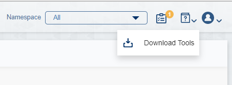

# Kubernetes/DIAMANTI Bootcamp

## 목적

- ### DIAMANTI 시스템 운영을 위한 초/중급 Kubernetes 실습 과정
- ### POD 생성, 스토리지 및 네트워크 연결 등 Kubernetes 전반적인 분야 실습
- ### 4 Hour + 5 Days 과정

### 사전 준비 사항
* Window 기준 아래 Tool 설치
> * [WSL(Window Subsystem Linux)](https://webdir.tistory.com/541)
> * [MS Visual CODE, IDE](https://webnautes.tistory.com/1197)
> * [Window Terminal(SSH Tool)](https://lts0606.tistory.com/341)
> * [WSL - Terminal 연동](https://docs.microsoft.com/ko-kr/windows/terminal/)
> * WSL Git 설치

### dctl, kubectl, helm Tool 설치 방법 (Diamanti Admin Page 우측 상단 클릭)



> * kc alias, kc 자동 완성 설정 [kubectl 환경 구성](https://kubernetes.io/ko/docs/reference/kubectl/cheatsheet/)

```
vi ~/.bashrc 

alias kc=kubectl
complete -F __start_kubectl kc
source <(kubectl completion bash)
```

> * 01_클러스터 관리 및 Default 네트워크 구성 부터 시작

### 자료
* 교육 슬라이드 (별도 배포)  

### Youtube Resources
* [김충섭 님 Kubernetes 소개 동영상(한글, 실습 포함)](https://youtu.be/WxzWXqTNdlw)

### Online Courses
* [Udemy CKA 자격증 과정, 강추](https://www.udemy.com/course/certified-kubernetes-administrator-with-practice-tests)


### Tutorials
* [김충섭(subicura) 님 도커, k8s 실습 GitHub Code](https://github.com/subicura/workshop-k8s-basic)

### Blog
* [아리수(Kakao) 님 Kubernetes](https://arisu1000.tistory.com/category/Kubernetes)
* [Diamanti 관련 블로그(한글)](https://blog.naver.com/hoon295)

### 책
 * [쿠버네티스 입문](http://www.yes24.com/Product/Goods/85578606?scode=032&OzSrank=2)
